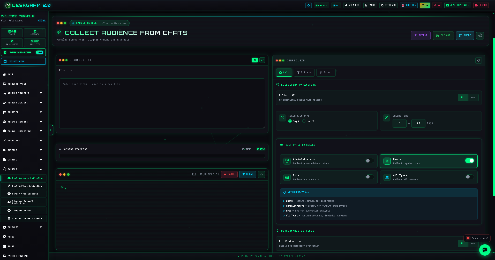
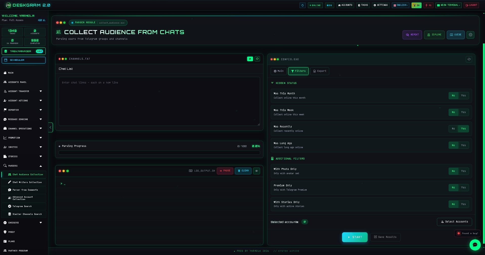
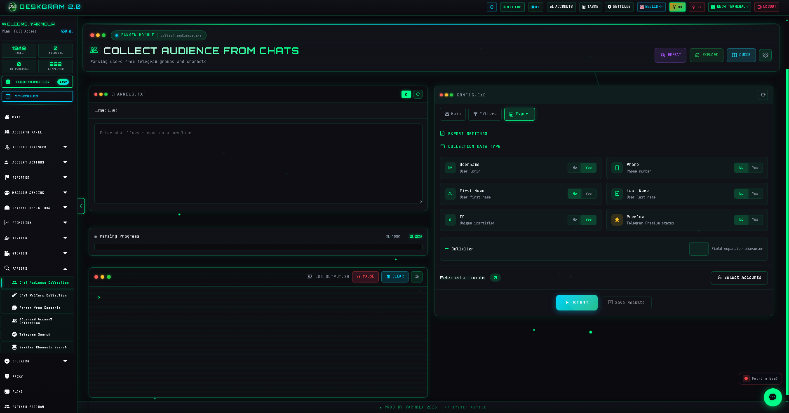

# Telegram Audience Parser with Deskgram 2

Audience Parser is a Deskgram 2 module for collecting users from Telegram groups and chats. It helps you prepare a user base for messaging, invite scenarios, and segmentation using filters based on activity, hidden status, profile photo, Premium, and other signals.

[Deskgram 2 Hub](https://github.com/Deskgram-2/deskgram-2-telegram-automation-en) · [Website](https://deskgram2.com/) · [Telegram Bot](https://t.me/DG2welcomebot) · [Web Preview](https://deskgram2.com/web-preview)

## About the module

| Parameter | What is inside |
|---|---|
| Main task | Parsing users from Telegram groups and chats |
| Filters | Online status, hidden status, profile photo, Premium, stories |
| Output | Exportable user base for next-step workflows |
| Useful for | Preparing bases for direct messaging and invite flows |
| Related modules | Direct Messaging, Invite, Accounts Panel |

## What it can do

- collect users from Telegram groups and chats;
- work with public and private sources;
- filter the audience by activity-related signals;
- exclude bots;
- export the parsed result into files;
- prepare a cleaner base for the next modules.

## Quick start

1. Set the list of chats or groups to parse.
2. Configure filters and collection mode.
3. Define performance settings.
4. Choose the export format.
5. Assign accounts and launch the task.

## Natural next steps after collection

- [Direct Messaging](https://github.com/Deskgram-2/telegram-direct-messaging-deskgram-en) if the collected base should move into private outreach.
- [Invite Tool](https://github.com/Deskgram-2/telegram-invite-tool-deskgram-en) if the base is meant for channel or group growth.
- [Account Manager](https://github.com/Deskgram-2/telegram-account-manager-deskgram-en) if you need to organize the working account layer first.
- [Join Groups](https://github.com/Deskgram-2/telegram-join-groups-deskgram-en) if the environment should be prepared before the next stage.

## Interface highlights

### Filters

### Logs and progress

## When it is especially useful

- when you need a user base for private messaging;
- when you are building an audience collection and invite flow;
- when filtering quality matters more than collecting everyone;
- when you want data export for the next stage.

## Why it is more convenient than manual collection

| Manual approach | Audience Parser in Deskgram 2 |
|---|---|
| You inspect users one by one | Collection is automated |
| Active and inactive users are harder to separate | Filters help segment the base |
| Scaling across many chats is difficult | Load is spread across accounts |
| Data is hard to move into the next tools | Export is part of the workflow |
| There is little process visibility | Progress, logs, and result states are visible |

## Related repositories

- [Deskgram 2 Hub](https://github.com/Deskgram-2/deskgram-2-telegram-automation-en)
- [Direct Messaging](https://github.com/Deskgram-2/telegram-direct-messaging-deskgram-en)
- [Join Groups](https://github.com/Deskgram-2/telegram-join-groups-deskgram-en)
- [Invite Tool](https://github.com/Deskgram-2/telegram-invite-tool-deskgram-en)
- [Account Manager](https://github.com/Deskgram-2/telegram-account-manager-deskgram-en)

## FAQ

### Can I collect everyone without filters?

Yes. You can run a broad collection mode if you do not need extra segmentation.

### Can I export the result?

Yes. The module is designed for further use of the collected base.
